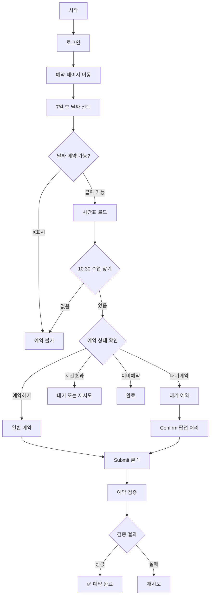

# 🏋️ 필라테스 자동 예약 시스템 v3.0 (개선된 버전)

에이디기구필라테스 10:30 수업 자동 예약 시스템

## 🎯 주요 개선사항

### 세션 1-2 분석 기반 개선
- ✅ **정확한 셀렉터 사용**: `input#user_id`, `input#passwd` 등 정확한 ID 기반 선택
- ✅ **대기예약 처리 개선**: confirm 팝업 자동 처리 로직 추가
- ✅ **예약 상태 구분**: 일반예약, 대기예약, 시간초과, 이미예약 상태 명확히 구분
- ✅ **Submit 버튼 처리**: 예약 후 Submit 버튼 클릭 로직 추가
- ✅ **검증 로직 강화**: 캘린더 * 표시로 대기예약 확인

## 📋 기능

- 매일 자정 자동 실행
- 7일 후 10:30 수업 예약
- 예약 실패 시 3회 재시도
- 대기예약 자동 처리 (정원 초과 시)
- 예약 완료 후 검증
- 스크린샷 및 로그 자동 저장

## 🚀 시작하기

### 1. 설치

```bash
npm install
```

### 2. 환경변수 설정

```bash
cp .env.example .env
# .env 파일 편집하여 회원정보 입력
```

### 3. 테스트

```bash
# 테스트 모드 (실제 예약하지 않음)
npm run book:test

# 예약 실행
npm run book
```

## 📝 스크립트 설명

| 명령어 | 설명 |
|--------|------|
| `npm run book` | 예약 실행 |
| `npm run book:test` | 테스트 모드 (실제 예약 안함) |
| `npm run test` | 시스템 테스트 |

## 🔑 GitHub Actions 설정

### Secrets 추가
1. Repository Settings → Secrets → Actions
2. 다음 시크릿 추가:
   - `PILATES_USERNAME`: 회원이름 (예: 홍길동)
   - `PILATES_PASSWORD`: 회원번호 (예: 8860)

## 📁 프로젝트 구조

```
pilates-booking-improved/
├── booking-script.js      # 메인 예약 스크립트 (개선됨)
├── package.json           # 프로젝트 설정
├── .env.example           # 환경변수 예제
└── .github/
    └── workflows/
        └── auto-booking.yml  # GitHub Actions 워크플로우
```

## 🔍 예약 프로세스



## ⚠️ 주의사항

- 회원번호는 비밀번호가 아닌 회원 고유번호입니다
- 자정에 실행되므로 GitHub Actions 스케줄 정확도에 의존합니다
- 대기예약은 취소가 발생하면 자동으로 정규예약으로 전환됩니다
- 예약 실패 시 로그를 확인하여 원인을 파악하세요

## 🐛 문제 해결

### 로그인 실패
- 회원이름과 회원번호가 정확한지 확인
- .env 파일이 제대로 설정되었는지 확인

### 예약 실패
- 10:30 수업이 있는지 확인
- 이미 예약이 꽉 찼는지 확인 (대기예약 처리됨)
- 스크린샷으로 상황 확인

### 대기예약 처리
- 정원 초과 시 자동으로 대기예약 등록
- 캘린더에 * 표시로 확인 가능
- 취소 발생 시 자동 전환

## 📊 결과 파일

`booking-result.json` 예시:
```json
{
  "timestamp": "2024-01-13T03:00:00.000Z",
  "date": "2024-1-20",
  "class": "10:30",
  "status": "SUCCESS",  // SUCCESS, WAITING, FAILED
  "message": "일반 예약 완료",
  "verified": true
}
```

## 🆕 v3.0 변경사항

1. **셀렉터 개선**: ID 기반 정확한 요소 선택
2. **대기예약 지원**: 정원 초과 시 자동 대기예약
3. **상태 구분**: 예약 상태를 명확히 구분하여 처리
4. **검증 강화**: 예약 후 캘린더 확인으로 검증
5. **에러 처리**: 시간초과, 이미예약 등 세분화된 처리

## 📄 라이센스

MIT
